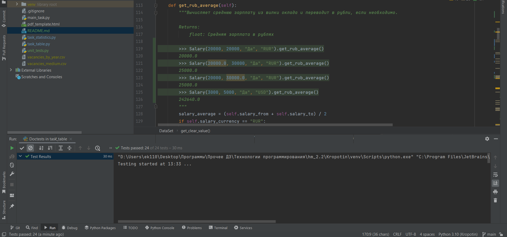
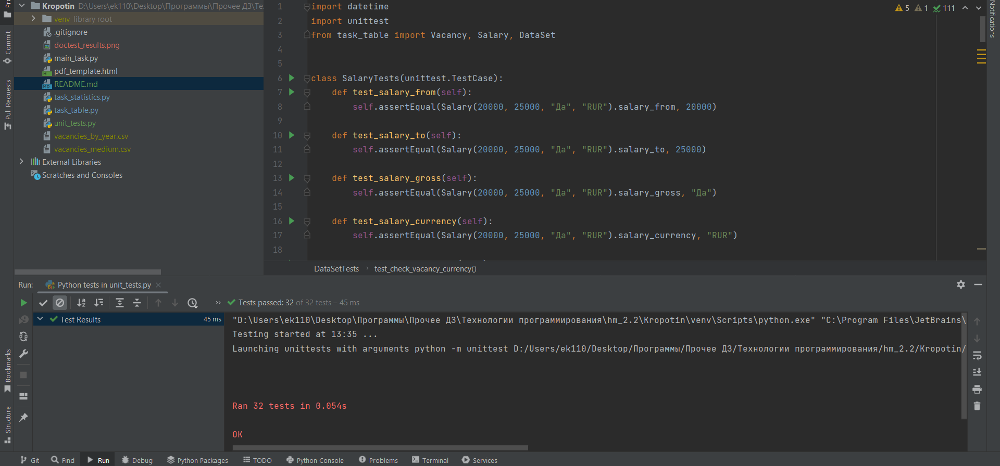
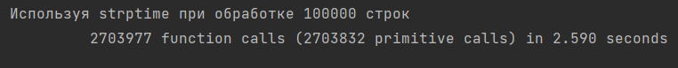
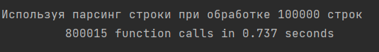
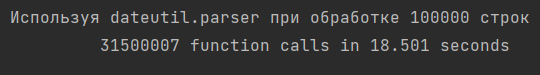
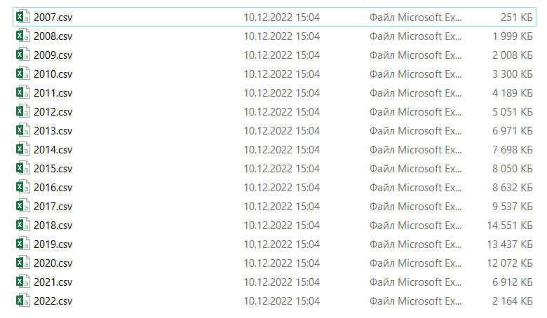
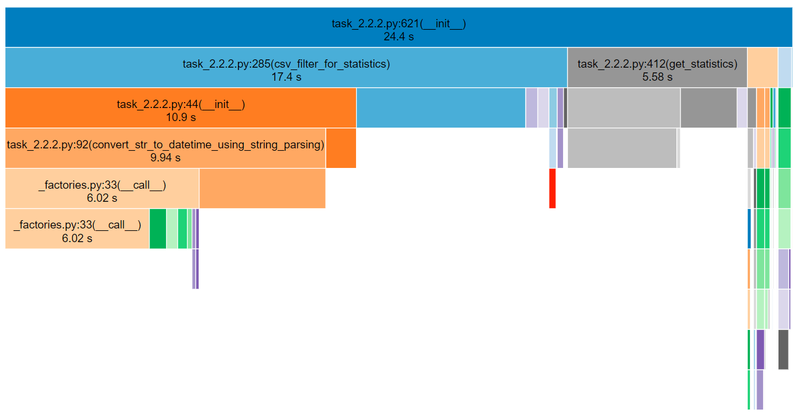
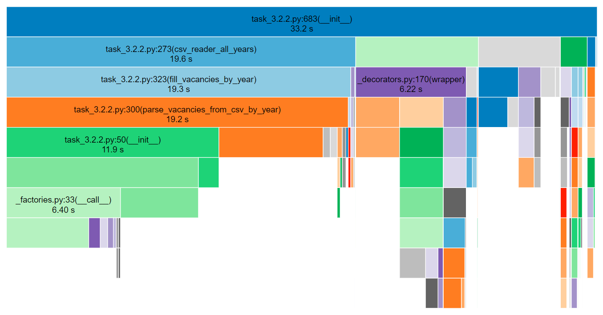

Результаты тестов:
1. doctest

2. unittest

Результаты замеров профилизатора:
1. strptime  

2. ручной парсинг строки и создание datetime  

3. dateutil.parser  

Результат разделения csv по годам:

Результат замеров профилизатора для многопоточности:
1. без multiprocessing  

2. c multiprocessing  
