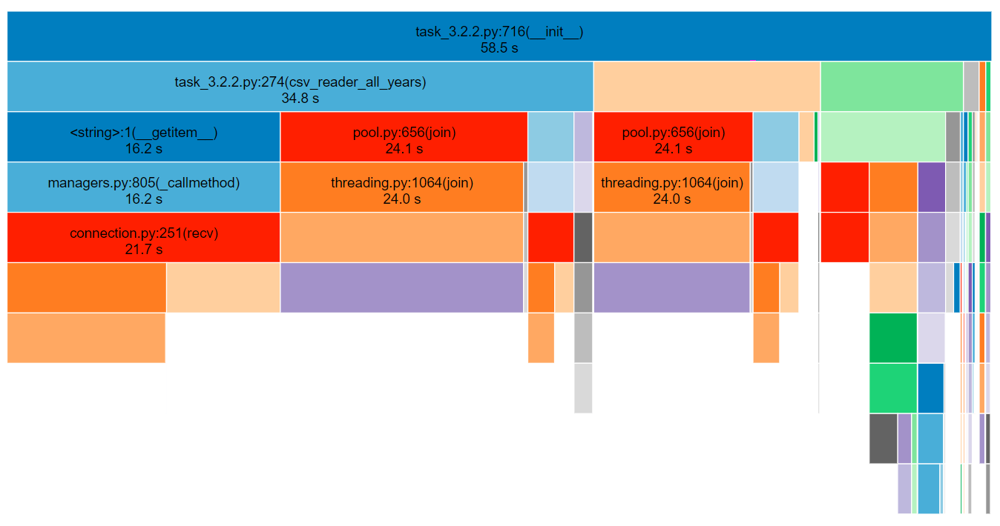

Результаты тестов:
1. doctest

2. unittest

Результаты замеров профилизатора:
1. strptime  

2. ручной парсинг строки и создание datetime  

3. dateutil.parser  

Результат разделения csv по годам:

Результат замеров профилизатора для многопоточности:
1. без multiprocessing  

2. c multiprocessing  

3. с concurrent  

Частотность валют за 2003 - 2022 года:

База данных с вакансиями:

Скриншоты для задачи 3.5.3:

